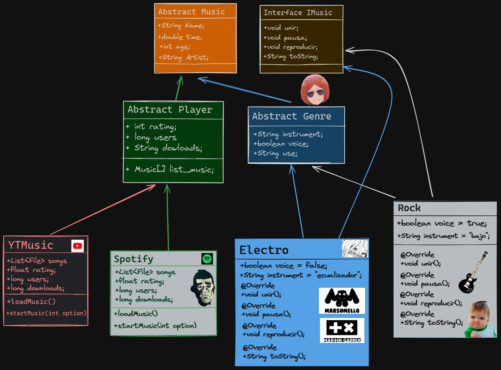

[Volver](../Info.md)
## Tarea de polimorfismo
Hola causa, esta es nuestra tarea de clases de polimorfismo, lo haremos de música xd.

### Diagrama de clase:

### Código
A continuación el código de todo este proyecto que al final es un reproductor de música xd.

### Clase abstracta e interfaz
Primero estan acá los 2 archivos principales de nuestra tarea, que son la interfaz y la clase abstracta.

> **Clase abstracta**

De esta clase se van a derivar los demás archivos

[Ver](../../src/U2/sem_1_polimosfirm/Music/Music.java) archivo.
```java
package U2.sem_1_polimosfirm.Music;
import java.io.File;

public abstract class Music { //Una simple clase con 5 atributos públicos 🦄
    public File path;
    public String name;
    public String artist;
    public double time;
    public int age;
}
```

> **Interfaz**

Esta es la interfaz qus se va a seguir.

[Ver](../../src/U2/sem_1_polimosfirm/Music/IMusic.java) archivo.
```java
package U2.sem_1_polimosfirm.Music;

public interface IMusic { //Estos son los metodos que se va a considerar
    void play();
    void stop();
    void unir(Music second);
    String toString();
}
```

### Primera derivación de clases
De las clases anteriores vamos a derivar 2 clases que son las siguienteS:

> **Clase "Player"**

Ver [archivo](../../src/U2/sem_1_polimosfirm/Music/Player.java).
```java
package U2.sem_1_polimosfirm.Music;

public abstract class Player extends Music{ //Se extiende a la clase "Music" y estos son sus atributos y metodos.
    Music[] list_son;
    float rating;
    long users;
    long downloads;
    public abstract void load_music();
    public abstract void start_music(int opt);
}
```

> **Clase "Genre"**

Ver [archivo](../../src/U2/sem_1_polimosfirm/Music/Genre.java).
```java
package U2.sem_1_polimosfirm.Music;

public abstract class Genre extends Music{
    String instrument;
    boolean voice;
    String use;
}
```

### Segunda derivación de clases
De las clases en la [primera derivación](#primera-derivación-de-clases) se van a derivar 2 mas, haciendo en total 4 clases en la segunda derivación.

> **Clase "Rock"**

Este se va a ser hijo de la clase "Genre", debido a que es un género de música xdxd. 🦍

*[Ver](../../src/U2/sem_1_polimosfirm/Music/Rock.java) archivo*
```java
package U2.sem_1_polimosfirm.Music;
import java.io.File;

public class Rock extends Genre implements IMusic { 
    public Rock(String name, double time, String artist,int age, File f) {
        this.name = name;
        this.time = time;
        this.artist = artist;
        this.age = age;
        this.path = f;
        //properities
        this.instrument = "Guitarra Eléctrica";
        this.voice = true;
        this.use = "Entretenimiento y relajo";
    }

    @Override
    public void play() {  
        System.out.println(this.toString());
    }
    
    @Override
    public void stop() {
        System.out.println("La música paró.");
    }

    @Override
    public void unir(Music second) {
        System.out.println("La música se unió a ");
    }

    @Override
    public String toString() {
        int minutes = (int)this.time/60;
        int seconds = (int)this.time%60;
        return "Que viva el rock, " + this.name + "("+this.artist+") del año " + this.age +"\n(00:00/"+minutes+":"+seconds+")";
    };
}
```

> **Clase "Electro"**

Este se va a ser hijo de la clase "Genre", debido a que es un género de música xdxd. ♻️♻️♻️

[Ver](../../src/U2/sem_1_polimosfirm/Music/Electro.java) archivo.
```java
package U2.sem_1_polimosfirm.Music;
import java.io.File;

public class Electro extends Genre implements IMusic {
    public Electro(String name, double time, String artist,int age, File f) {
        this.name = name;
        this.time = time;
        this.artist = artist;
        this.age = age;
        this.path = f;
        //properities
        this.instrument = "Audacity";
        this.voice = false;
        this.use = "Entretenimiento y relajo";
    }

    @Override
    public void play() {  
        System.out.println(this.toString());
    }
    
    @Override
    public void stop() {
        System.out.println("La música paró.");
    }

    @Override
    public void unir(Music second) {
        System.out.println("La música se unió a ");
    }

    @Override
    public String toString() {
        int minutes = (int)this.time/60;
        int seconds = (int)this.time%60;
        return "Que viva el rock, " + this.name + "("+this.artist+") del año " + this.age +"\n(00:00/"+minutes+":"+seconds+")";
    };
}

```